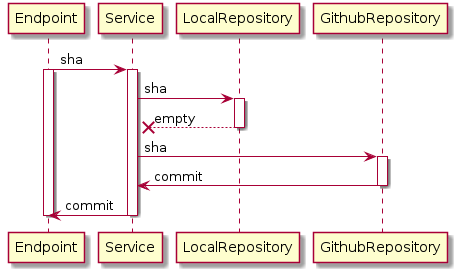
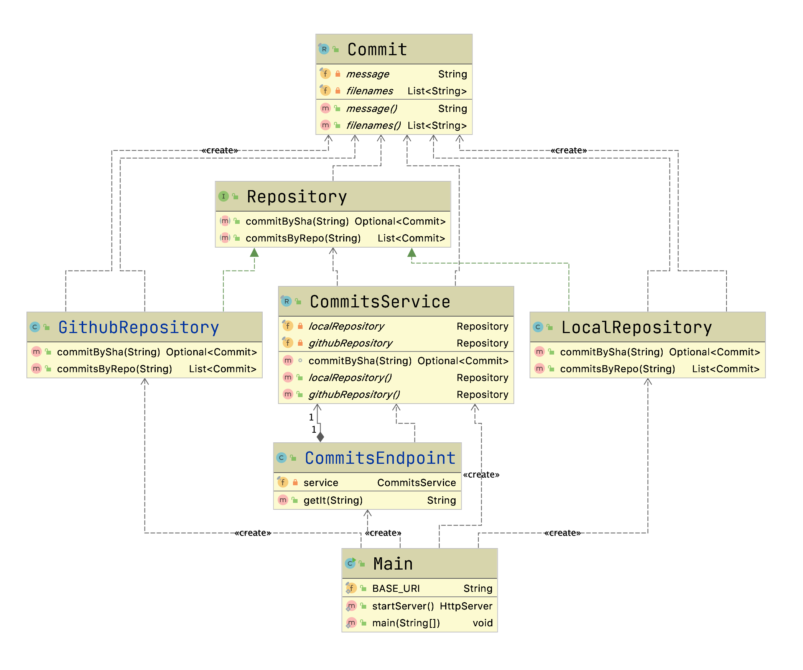

# Decoupling in Java

## Example Application

### Sequence Diagram



### Class Diagram


### What's wrong with this design

- Primitives Obsession
- Shared DTOs between layers
- Coupling

## Running the Application

```shell script
$ mvn compile exec:java
```

```shell script
$ curl http://localhost:8080/commits/abcdef

Commit[message=Commit from git, filenames=[filea.txt,, fileb.txt]]
```
